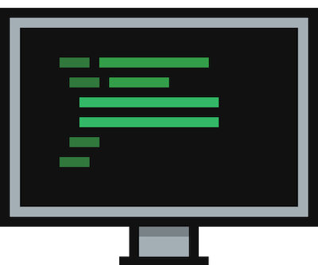
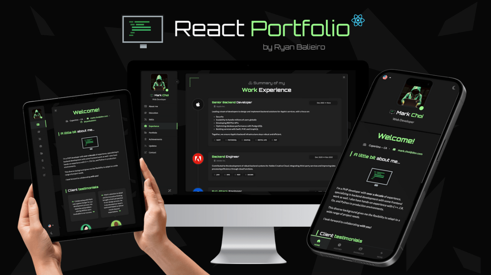
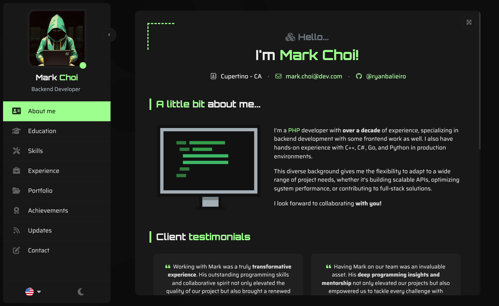
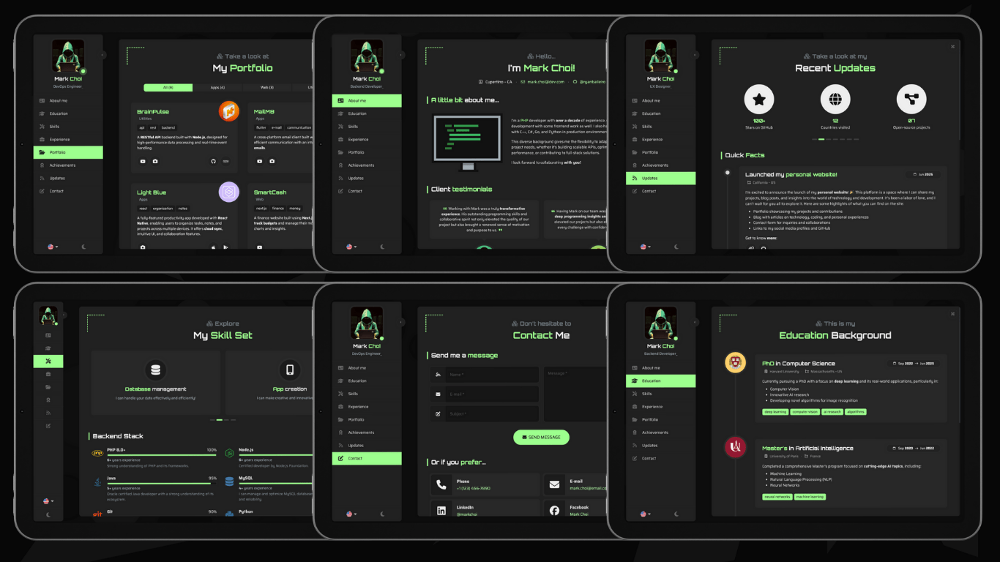
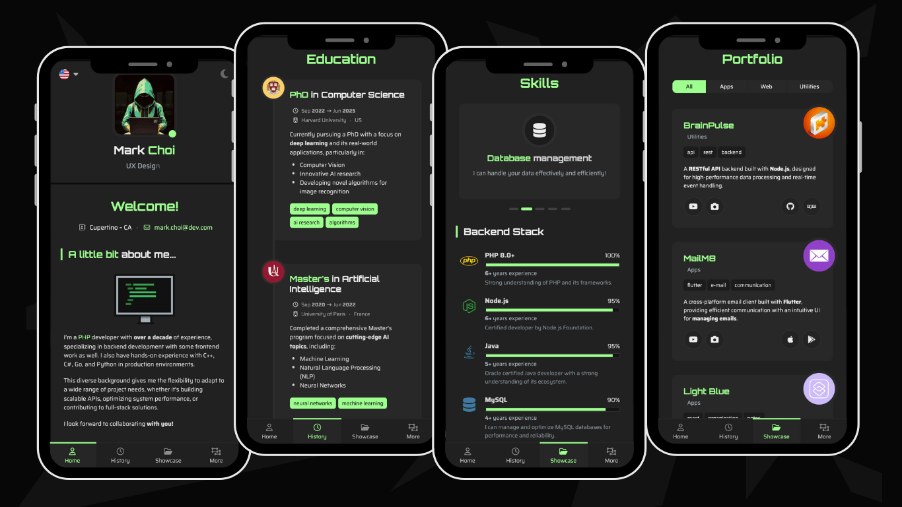

<p align="center">
    
</p>

# [React Portfolio](https://abduklzakirkhan.github.io/my-portfolio-/) by Abdul Zakir

A sleek, futuristic portfolio template for developers – built with **React** and **Bootstrap 5**.



Key features:
- Lightweight and fully responsive.
- Adapts perfectly to mobile screens.
- Multi-language support included.
- Comes with both dark and light theme options.
- A variety of components to highlight your work experience, education, skills, portfolio, and more.
- Uses **Vite** for packaging.
- Emails with **EmailJS** - no backend needed!

## Live Preview

Here's a list of live versions of the template:

| #     | Version             | Description                                             | URL                                                                     |
|-------|---------------------|---------------------------------------------------------|-------------------------------------------------------------------------|
| 🟢    | Mark Choi (default) | Latest deployment of the template here on GitHub pages. | [Preview](https://abduklzakirkhan.github.io/my-portfolio-/)     |
| 🟣    | Emily Park          | An example of how the template can be customized.       | [Preview](https://abduklzakirkhan.github.io/my-portfolio-/)    |
| 🔵    | Michael Özkan       | Another example of how the template can be customized.  | [Preview](https://abduklzakirkhan.github.io/my-portfolio-/) |

## Layout and concept

### 1. Base layout
The layout uses a fixed central view with a left sidebar, adjusting perfectly across various monitor resolutions, from 4:3 to ultra-wide.



### 2. Desktop Screenshots
The main view transitions smoothly when a new page is selected from the sidebar, giving a page-flipping effect. The sidebar is also toggleable, allowing the content area to expand for a larger viewing space.



### 3. Mobile Screenshots
On mobile, the layout groups the portfolio sections into categories and transforms into a tabbed interface with a bottom navigation.



## Getting Started

1. Clone the repo:
```
git clone https://abduklzakirkhan.github.io/my-portfolio-/
```

2. Go to the project's root folder and use npm to install all required components:
```
npm install
```

3. Launch the project in developer mode:
```
npm run dev
```
## About

This template was created by and is maintained by **[Ryan Balieiro](https://ryanbalieiro.com/)**.

It's based on the **[React](https://reactjs.org/)** framework created by Jordan Walke, and the **[Bootstrap](https://getbootstrap.com/)** framework created by Mark Otto and Jacob Thorton.

Additional frameworks and plugins used include:
- **Smooth Scrollbar**: A customizable scrollbar plugin.
- **Swiper**: A powerful library for creating touch sliders.
- **EmailJS**: A free service that allows you to send emails using JavaScript.
- **Font Awesome**: A library of free vector icons.
- **PrimeIcons**: A collection of premium line icons.

## Copyright and License

Code released under the [MIT](https://github.com/StartBootstrap/startbootstrap-agency/blob/master/LICENSE) license, providing complete freedom for utilization. Feel free to enhance and adapt it to suit your needs.

Oh... and if you like this template, don't forget to **give it a ⭐** :)